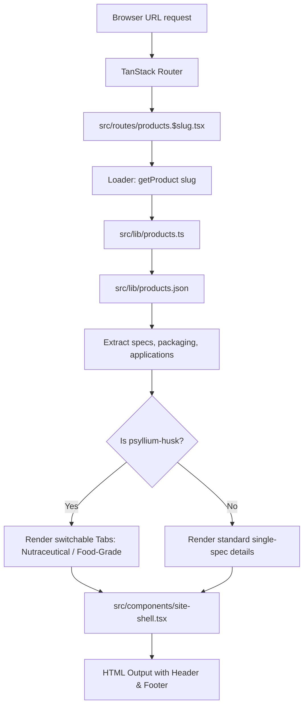

# Project Brain Map — Lokavia

This file serves as a persistent, single-source-of-truth map of the Lokavia codebase for AI coding agents and developers. Refer to this file before scanning the codebase or writing new code.

---

## 1. Project Overview

*   **Purpose**: Lokavia website (agri-commodity exporter sourcing dehydrated vegetables, spices, and nutraceutical fibre from India's primary agricultural belts to global industrial buyers).
*   **Design Philosophy**: Clean, minimal, typography-led aesthetic. Dark slate/ink for text (`text-ink`), off-whites for section backdrops, with navy and orange used as restrained accents.
*   **Tech Stack**:
    *   **Core**: React 19 (TypeScript), Vite 8
    *   **Routing**: TanStack Start / TanStack Router (File-based routing)
    *   **Styling**: Tailwind CSS 4, Vanilla CSS
    *   **Icons**: Lucide React
    *   **Validation & Forms**: React Hook Form, Zod

---

## 2. Codebase Structure

```
lokaviainternational.com/
├── src/
│   ├── assets/              # Static media assets (logo, botanical background, etc.)
│   ├── components/
│   │   ├── ui/              # Reusable UI components (shadcn primitives)
│   │   ├── site-footer.tsx  # Dark-themed high-contrast site footer
│   │   ├── site-header.tsx  # Sticky glassmorphism header that floats on scroll
│   │   └── site-shell.tsx   # Global page shell wrapper supplying header and footer
│   ├── hooks/
│   │   └── use-mobile.tsx   # React hook for mobile screen width detection
│   ├── lib/
│   │   ├── error-capture.ts # Lovable error monitoring capture
│   │   ├── products.ts      # Product utility loader and type definitions
│   │   ├── products.json    # Structured JSON product catalog (content source)
│   │   └── utils.ts         # Class name merger helper (cn)
│   ├── routes/              # TanStack File-Based Router entry points
│   │   ├── __root.tsx       # Root layout context and HTML meta template
│   │   ├── index.tsx        # Homepage (full-width watercolor hero and preview)
│   │   ├── about.tsx        # About page (featuring hourglass-curved hero and stats card)
│   │   ├── quality-sourcing.tsx # Quality and sourcing compliance documentation page
│   │   ├── products.tsx     # Products layout parent wrapper
│   │   ├── products.index.tsx   # Products list page
│   │   ├── products.$slug.tsx   # Dynamic product detail page (Psyllium Husk switchable tabs)
│   │   ├── quote.tsx        # Request for Quote form submission page
│   │   ├── privacy-policy.tsx # Privacy policy compliance page (RFQ data & storage rules)
│   │   ├── terms-of-use.tsx # Terms of Use page (disclaimers & India governing law)
│   │   ├── insights.tsx     # Sourcing and logistics insights placeholder page
│   │   └── sitemap[.]xml.ts # Dynamic XML sitemap generator endpoint
│   ├── routeTree.gen.ts     # Auto-generated TanStack Route tree mappings
│   ├── router.tsx           # TanStack router setup
│   ├── styles.css           # Global CSS and Tailwind directives
│   ├── server.ts            # TanStack Start server entry point
│   └── start.ts             # TanStack Start client hydration entry point
├── public/                  # Publicly served static files
│   ├── product-*.jpg        # Product catalog images (accessible via absolute URLs)
│   ├── favicon.ico          # Browser tab favicon icon
│   └── robots.txt           # Search engine robot directions
├── package.json             # Build commands, scripts, and package version list
├── vite.config.ts           # Vite bundler configuration
└── tone_of_voice.md         # Content copywriting and calibration rules
```

---

## 3. Concern Map & Feature Locations

| Concern / Feature | File Path(s) | Description |
| :--- | :--- | :--- |
| **Routing Config** | `src/routes/` | File-based routes matching the URL paths directly. |
| **Product Loader** | `src/lib/products.ts` | Loader and types; parses and exports the JSON product data. |
| **Editable Content** | `src/lib/products.json` | Isolated database of product descriptions, specs, and packaging. |
| **Global Theme Styles** | `src/styles.css` | Custom theme variables (e.g. `--navy`, `--orange`, `--hairline` border color). |
| **Global Layout Wrapper** | `src/components/site-shell.tsx` | Site-wide header, footer, and main layout structure. |
| **Sitemap Generation** | `src/routes/sitemap[.]xml.ts` | Server handler mapping sitemap routes to raw XML output. |
| **Quotes & Forms** | `src/routes/quote.tsx` | RFQ form validation logic, input fields, and submission actions. |

---

## 4. Architecture & Data Flow



---

## 5. Content Management

To ensure content (such as specifications, certifications, and product details) can be updated post-launch by non-developers without redeploying code, the project decouples application code from raw data:

*   **Isolated Database File**: All product data resides in the structured JSON file [src/lib/products.json](file:///c:/Users/lokes/OneDrive/Desktop/lokaviainternational.com/src/lib/products.json).
*   **Static Assets**: Product images are hosted in the `public/` directory and referenced in JSON by their static web URLs (e.g. `/product-onion-powder.jpg`), removing the need for dynamic asset compilation or bundling.
*   **Decap CMS (Git-Based CMS) Integration**: 
    *   A headless Git-based CMS (like Decap CMS) can be added by defining an admin page at `/admin` (loaded via a simple HTML wrapper in `public/admin/index.html`).
    *   Decap CMS provides a user-friendly form GUI for non-developers to edit `products.json` and upload new images.
    *   Upon saving, the CMS commits the modified `products.json` directly to the project's Git repository.
    *   This commit triggers the automated CI/CD build process (e.g. on Cloudflare Pages, Netlify, or GitHub Actions) which rebuilds the static files and deploys the updates without manual developer intervention.
*   **Runtime Fetch Alternative**: If zero-build real-time updates are required, the loader inside `src/lib/products.ts` can be updated to fetch `products.json` at runtime from an external CDN, bucket, or micro-API endpoint.

---

## 6. Development Conventions

*   **File-Based Routing**: To add a page at `/path`, create `src/routes/path.tsx`. Export a file route using `export const Route = createFileRoute('/path')({ component: ... })`.
*   **Contrast & Legibility (WCAG AA)**: Always place a semi-transparent scrim (e.g., `bg-white/40` or `bg-background/70`) over image backgrounds when overlays contain text.
*   **Theme Styling**: Avoid standard Tailwind color utility classes where semantic colors are preferred (e.g., use `text-ink` for black text, `text-ink-soft` for slate/gray, and `border-hairline` for custom gray borders).
*   **Trade Lingo**: Use proper trade lingo without over-explaining (FOB, CIF, MOQ, Incoterms) to connect with professional industrial buyers.

---

## 7. Gotchas & Non-Obvious Decisions

*   **Sitemap Delimiter Escaping**: The XML sitemap is named `sitemap[.]xml.ts` with square brackets. This prevents the router from treating the dot in `sitemap.xml` as a dynamic sub-route/layout delimiter.
*   **Mobile Header Expanding**: The scroll listener toggles `scrolled` state to float the header. However, when the mobile menu is opened, floating is disabled (`shouldFloat = scrolled && !open`) so that the dropdown expands flatly against the top without clipping or layout breaks.
*   **Psyllium Husk Tab Duplication Avoidance**: The product details on `/products/psyllium-husk` are split into two Tabs. A sub-component `ProductDetails` is defined to render the sections dynamically, avoiding copy-pasting 150+ lines of identical layout.
*   **Legal vs. Marketing Name**: General site copy should use **"Lokavia"** only. Reserve the full legal name **"Lokavia International"** (Sole Proprietorship structure) for formal footers, copyright statements, legal pages, sitemaps, and quote terms. Do not invent or assume any other corporate legal structure (such as "Pvt. Ltd.").

---

## 8. Project Changelog & Updates

### July 25, 2026 — Certification Audit & Compliance Updates
*   **FSSAI Integration**: Replaced the Spices Board RCMC card with FSSAI in the Compliance & Registrations section on the About page (`src/routes/about.tsx`), representing FSSAI as an in-progress registration and updating the FAQ.
*   **ISO 22000 & HACCP Status Correction**: Audited the entire codebase for mentions of ISO 22000, HACCP, and US FDA. Corrected the representation of these certifications to reflect they are in our planned pipeline and not currently active:
    *   Removed `ISO 22000` and `HACCP` from the active certifications list in the product catalog (`src/lib/products.json`).
    *   Replaced `"ISO · HACCP"` in the home page stats section with `"FSSAI"`.
    *   Updated the "Certified & tested" value pillar description on the home page to note FSSAI status and planned ISO/HACCP timeline.
    *   Relabeled the home page certification details grid values for ISO 22000 & HACCP to `"Planned pipeline"`.
    *   Updated FAQ responses on the FAQ page (`src/routes/faq.tsx`) and About page (`src/routes/about.tsx`) to state that active certifications are FSSAI, with ISO 22000/HACCP in the planned facility pipeline.
*   **Documentation Alignment**: Updated the content map (`Refer.md/content-map.md`) and project brain map (`Refer.md/brain.md`) to align with these updates.

### July 25, 2026 — Content & Data Alignment Updates
*   **Draft Banner Removal**: Deleted the yellow "Legal Disclaimer & Draft Status" warning banners from the Privacy Policy (`src/routes/privacy-policy.tsx`) and Terms of Use (`src/routes/terms-of-use.tsx`) pages.
*   **Dynamic Psyllium Husk Grade Variants**: Moved the hardcoded inline constant for Food-Grade Psyllium from the code (`src/routes/products.$slug.tsx`) into the JSON database (`src/lib/products.json`), and updated type definitions in `src/lib/products.ts` to dynamically support variants (Nutraceutical vs Food-Grade) editable via Decap CMS.
*   **Contact Email Consolidation**: Updated the contact email address in the Privacy Policy page from `lokesh@lokaviainternational.com` to `info@lokaviainternational.com` to unify all email endpoints.
*   **FSSAI Status Upgrade**: Moved FSSAI from "In Progress" to "Active" on the About page compliance grid, upgrading its status badge.
*   **Sourcing Origins Reconciliation**: Resolved contradictions in sourcing regions across the site. Standardized all locations to: Gujarat (onion and psyllium), Madhya Pradesh (garlic), and Kerala/Assam (ginger). Updated matching text on Home value pillars, About sourcing description, and Quality & Sourcing direct origin hubs description.

### July 25, 2026 — Pre-Launch Final Review & Refinements
*   **Decoupled Product Introductions (CMS Gap)**: Moved all product introduction/overview texts (AEO/GEO openers) from the inline `getAeoOpener` helper in `src/routes/products.$slug.tsx` to a new `"introduction"` field in the `products.json` database. Updated `Product` and `variants` types in `src/lib/products.ts` and refactored the detail page to render `p.introduction` dynamically.
*   **Production Sitemap Configuration**: Set the `BASE_URL` in `src/routes/sitemap[.]xml.ts` to point to `"https://lokaviainternational.com"`. Added missing `/faq` route to the sitemap entries, and retained `/insights` route as requested.
*   **Cookie Consent GA4 & Google Ads Integration**: Created a new consent-aware analytics utility in `src/lib/analytics.ts`. Wired `initGoogleTags` to trigger only when cookie preferences are accepted in `src/components/cookie-consent.tsx`. Added conversion and event tracking (`trackRfqSubmission`) on successful form submission in `src/routes/quote.tsx`.
*   **Documentation Alignment**: Updated sitemap routes and schema documentation in `Refer.md/brain.md` and `Refer.md/content-map.md`.
